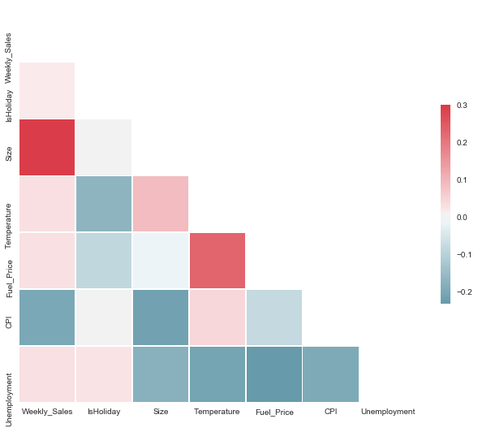

# Scrubbing and Cleaning Data - Lab

## Introduction

In the previous labs, you joined the data from our separate files into a single DataFrame.  In this lab, you'll scrub the data to get it ready for exploration and modeling!

## Objectives

You will be able to:

* Cast columns to the appropriate data types
* Identify and deal with null values appropriately
* Remove unnecessary columns
* Understand how to normalize data


## Getting Started

You'll find the resulting dataset from our work in the _Obtaining Data_ Lab stored within the file `walmart_data_not_cleaned.csv`.  

In the cells below:

* Import pandas and set the standard alias
* Import numpy and set the standard alias
* Import matplotlib.pyplot and set the standard alias
* Import seaborn and set the alias `sns` (this is the standard alias for seaborn)
* Use the ipython magic command to set all matplotlib visualizations to display inline in the notebook
* Load the dataset stored in the .csv file into a DataFrame using pandas
* Inspect the head of the DataFrame to ensure everything loaded correctly


```python
# Import statements go here
import pandas as pd
import numpy as np
import seaborn as sns
import matplotlib.pyplot as plt
%matplotlib inline
```


```python
# Now, load in the dataset and inspect the head to make sure everything loaded correctly
df = pd.read_csv("walmart_data_not_cleaned.csv")
df.head()
```


<div>
<style scoped>
    .dataframe tbody tr th:only-of-type {
        vertical-align: middle;
    }

    .dataframe tbody tr th {
        vertical-align: top;
    }

    .dataframe thead th {
        text-align: right;
    }
</style>
<table border="1" class="dataframe">
  <thead>
    <tr style="text-align: right;">
      <th></th>
      <th>Store</th>
      <th>Dept</th>
      <th>Date</th>
      <th>Weekly_Sales</th>
      <th>IsHoliday</th>
      <th>Type</th>
      <th>Size</th>
      <th>Temperature</th>
      <th>Fuel_Price</th>
      <th>MarkDown1</th>
      <th>MarkDown2</th>
      <th>MarkDown3</th>
      <th>MarkDown4</th>
      <th>MarkDown5</th>
      <th>CPI</th>
      <th>Unemployment</th>
    </tr>
  </thead>
  <tbody>
    <tr>
      <th>0</th>
      <td>1</td>
      <td>1</td>
      <td>2010-02-05</td>
      <td>24924.50</td>
      <td>False</td>
      <td>A</td>
      <td>151315</td>
      <td>42.31</td>
      <td>2.572</td>
      <td>NaN</td>
      <td>NaN</td>
      <td>NaN</td>
      <td>NaN</td>
      <td>NaN</td>
      <td>211.096358</td>
      <td>8.106</td>
    </tr>
    <tr>
      <th>1</th>
      <td>1</td>
      <td>2</td>
      <td>2010-02-05</td>
      <td>50605.27</td>
      <td>False</td>
      <td>A</td>
      <td>151315</td>
      <td>42.31</td>
      <td>2.572</td>
      <td>NaN</td>
      <td>NaN</td>
      <td>NaN</td>
      <td>NaN</td>
      <td>NaN</td>
      <td>211.096358</td>
      <td>8.106</td>
    </tr>
    <tr>
      <th>2</th>
      <td>1</td>
      <td>3</td>
      <td>2010-02-05</td>
      <td>13740.12</td>
      <td>False</td>
      <td>A</td>
      <td>151315</td>
      <td>42.31</td>
      <td>2.572</td>
      <td>NaN</td>
      <td>NaN</td>
      <td>NaN</td>
      <td>NaN</td>
      <td>NaN</td>
      <td>211.096358</td>
      <td>8.106</td>
    </tr>
    <tr>
      <th>3</th>
      <td>1</td>
      <td>4</td>
      <td>2010-02-05</td>
      <td>39954.04</td>
      <td>False</td>
      <td>A</td>
      <td>151315</td>
      <td>42.31</td>
      <td>2.572</td>
      <td>NaN</td>
      <td>NaN</td>
      <td>NaN</td>
      <td>NaN</td>
      <td>NaN</td>
      <td>211.096358</td>
      <td>8.106</td>
    </tr>
    <tr>
      <th>4</th>
      <td>1</td>
      <td>5</td>
      <td>2010-02-05</td>
      <td>32229.38</td>
      <td>False</td>
      <td>A</td>
      <td>151315</td>
      <td>42.31</td>
      <td>2.572</td>
      <td>NaN</td>
      <td>NaN</td>
      <td>NaN</td>
      <td>NaN</td>
      <td>NaN</td>
      <td>211.096358</td>
      <td>8.106</td>
    </tr>
  </tbody>
</table>
</div>


Great! Everything looks just like we left it as.  Now, you can begin cleaning the data. 


## Dealing with Oversized Datasets

This dataset is quite large. Often, when starting out on a project, its a good idea to build the model on a subset of the data so that you're not bogged down by large runtimes. 

In the cell below, check how many rows this dataset contains.


```python
len(df)
```


    421570


This dataset contains `421570` rows! That's large enough that you should consider building our model on a subset of the data to increase our speed during the modeling step.  Modeling is an iterative process, and you'll likely have to fit out model multiple times as you tweak it--by subsetting the dataset, you'll protect yourself from insane runtimes every time you make a small change and need to rerun the model. Once you have a prototype built, you can always add all the extra data back in!

### Subsetting our Dataset

The typical method for subsetting our dataset is to just take a random sample of data.  This is an option for us.  However, when we inspect the columns of our dataset in a bit, we'll notice that we have 2 categorical columns with very high cardinality--`Store`, and `Dept`.  This provides us with an opportunity to reduce dimensionality while subsampling.  Instead of building a model on all the stores and departments in our dataset, we'll subset our data so that it only contains stores 1 through 10.  

In the cell below, slice our dataset so that only rows with a `Store` value between 1 and 10 (inclusive) remain. 


```python
df = df[df["Store"] <= 10]
```


```python
len(df)
```


    97839


## Starting our Data Cleaning

To start, you'll deal with the most obvious issue: data features with the wrong data encoding.

### Checking Data Types

In the cell below, use the appropriate method to check the data type of each column. 


```python
df.info()
```

    <class 'pandas.core.frame.DataFrame'>
    Int64Index: 97839 entries, 0 to 97838
    Data columns (total 16 columns):
    Store           97839 non-null int64
    Dept            97839 non-null int64
    Date            97839 non-null object
    Weekly_Sales    97839 non-null float64
    IsHoliday       97839 non-null bool
    Type            97839 non-null object
    Size            97839 non-null int64
    Temperature     97839 non-null float64
    Fuel_Price      97839 non-null float64
    MarkDown1       35013 non-null float64
    MarkDown2       27232 non-null float64
    MarkDown3       32513 non-null float64
    MarkDown4       34485 non-null float64
    MarkDown5       35013 non-null float64
    CPI             97839 non-null float64
    Unemployment    97839 non-null float64
    dtypes: bool(1), float64(10), int64(3), object(2)
    memory usage: 12.0+ MB


Now, investigate the unique values inside of the `Store` and `Dept` columns.

In the cells below, use the appropriate DataFrame method to display all the unique values in the `Store` column, and in the `Dept` column.


```python
df.Store.unique()
```


    array([ 1,  2,  3,  4,  5,  6,  7,  8,  9, 10])


```python
df.Dept.unique()
```


    array([ 1,  2,  3,  4,  5,  6,  7,  8,  9, 10, 11, 12, 13, 14, 16, 17, 18,
           19, 20, 21, 22, 23, 24, 25, 26, 27, 28, 29, 30, 31, 32, 33, 34, 35,
           36, 37, 38, 40, 41, 42, 44, 45, 46, 47, 48, 49, 51, 52, 54, 55, 56,
           58, 59, 60, 67, 71, 72, 74, 79, 80, 81, 82, 83, 85, 87, 90, 91, 92,
           93, 94, 95, 97, 98, 78, 96, 99, 77, 39, 50])


### Categorical Data Stored as Integers

A common issue to check for at this stage is numeric columns that have accidentally been encoded as strings.  However, in this dataset, you should notice that although the `Store` and `Dept` columns are both encoded as integer values, they are categorical data representing specific stores or departments.  As such, you'll want to convert these columns to strings, so that you can then use the `pd.get_dummies()` method to create binary dummy variables. This representation, binary dummy variables, is the most appropriate encoding mechanism for categorical data when then feeding the dataset into many machine learning algorithms such as simple linear regression. If left with numeric encoding, a model would interpret Store 2 as twice Store 1 and half of Store 4.  These sorts of mathematical relationships don't make sense when integers are used to as identifiers for categories.  

In the cell below, cast the `Store` and `Dept` columns to strings. 


```python
df.Store = df.Store.astype("str")
df.Dept = df.Dept.astype("str")
```

### Numeric Data Stored as Strings

It looks like there are two columns that are already encoded as strings (remember, pandas denotes string columns as `object`)--`Date` and `Type`.

For now, don't worry about `Date`. Quickly check out the `Type` column just to ensure that it doesn't contain numeric data.

In the cell below, get the unique values contained within the `Type` column. 


```python
df.Type.unique()
```


    array(['A', 'B'], dtype=object)


Great job--the `Type` column is clearly a categorical column. You'll first need to deal with the null values but can then use the `pd.get_dummies()` again.

Double check the column encodings again as a sanity check to make sure that everything you did above is reflected in the dataset.


```python
df.info()
```

    <class 'pandas.core.frame.DataFrame'>
    Int64Index: 97839 entries, 0 to 97838
    Data columns (total 16 columns):
    Store           97839 non-null object
    Dept            97839 non-null object
    Date            97839 non-null object
    Weekly_Sales    97839 non-null float64
    IsHoliday       97839 non-null bool
    Type            97839 non-null object
    Size            97839 non-null int64
    Temperature     97839 non-null float64
    Fuel_Price      97839 non-null float64
    MarkDown1       35013 non-null float64
    MarkDown2       27232 non-null float64
    MarkDown3       32513 non-null float64
    MarkDown4       34485 non-null float64
    MarkDown5       35013 non-null float64
    CPI             97839 non-null float64
    Unemployment    97839 non-null float64
    dtypes: bool(1), float64(10), int64(1), object(4)
    memory usage: 12.0+ MB


### Detecting and Dealing With Null Values

Next, it's time to check for null values. How to deal with the null values will be determined by the columns containing them, and how many null values exist in each.  
 
In the cell below, get a count of how many null values exist in each column in the DataFrame. 


```python
df.isna().sum()
```


    Store               0
    Dept                0
    Date                0
    Weekly_Sales        0
    IsHoliday           0
    Type                0
    Size                0
    Temperature         0
    Fuel_Price          0
    MarkDown1       62826
    MarkDown2       70607
    MarkDown3       65326
    MarkDown4       63354
    MarkDown5       62826
    CPI                 0
    Unemployment        0
    dtype: int64


  


```python
df["MarkDown3"].value_counts()
```


    3.00     403
    1.00     331
    6.00     277
    1.65     217
    2.97     208
    2.00     197
    2.02     197
    0.55     193
    10.80    145
    8.11     145
    24.60    144
    4.20     141
    4.26     140
    6.50     140
    3.20     137
    0.22     136
    1.88     136
    6.01     135
    17.36    134
    0.25     134
    7.50     133
    3.39     133
    0.50     133
    0.60     132
    2.20     132
    3.72     130
    4.00     128
    0.24     127
    3.01     127
    1.71     126
            ... 
    0.51      62
    22.74     62
    1.04      62
    6.48      62
    24.70     62
    41.58     62
    0.68      62
    5.85      62
    2.46      62
    0.70      62
    4.54      62
    50.03     62
    4.46      62
    30.92     62
    1.40      62
    10.00     62
    30.18     62
    65.34     62
    42.75     61
    13.00     61
    10.75     61
    1.80      61
    8.08      61
    0.36      61
    52.06     61
    12.00     61
    6.02      61
    9.61      61
    68.00     61
    2.31      60
    Name: MarkDown3, Length: 425, dtype: int64


Now, get some descriptive statistics for each of the columns. You want to see where the minimum and maximum values lie.  


```python
display(df["MarkDown1"].describe())
```


    count    35013.000000
    mean      7048.166982
    std       7656.783543
    min         35.940000
    25%       2639.050000
    50%       5126.540000
    75%       8813.810000
    max      75149.790000
    Name: MarkDown1, dtype: float64


```python
display(df["MarkDown2"].describe())
```


    count     27232.000000
    mean       3210.994407
    std       10683.244951
    min         -10.980000
    25%          24.030000
    50%         148.950000
    75%        1555.570000
    max      104519.540000
    Name: MarkDown2, dtype: float64


```python
display(df["MarkDown3"].describe())
```


    count     32513.000000
    mean       1553.120097
    std       10595.395278
    min           0.010000
    25%           4.530000
    50%          21.120000
    75%          96.350000
    max      141630.610000
    Name: MarkDown3, dtype: float64


```python
display(df["MarkDown4"].describe())
```


    count    34485.000000
    mean      2934.328386
    std       5199.795541
    min          4.000000
    25%        426.510000
    50%       1183.640000
    75%       3463.030000
    max      48159.860000
    Name: MarkDown4, dtype: float64


```python
display(df["MarkDown5"].describe())
```


    count    35013.000000
    mean      4706.398300
    std       5347.922707
    min        135.160000
    25%       2007.500000
    50%       3592.820000
    75%       5630.400000
    max      58068.140000
    Name: MarkDown5, dtype: float64


Now that you have a bit more of a understanding of each of these features you can now make an informed decision about the best strategy for dealing with the various null values. 

* The data contained within each column are continuously-valued floats. 
* The range is quite large, with the smallest value being around 0 or even negative in some columns, and the max being greater than 100,000.
* There is extremely high variance in each, with the standard deviation being larger than the mean in all 5 columns. 


### Dealing With Null Values Through Binning

This suggests that the best bet is to bin the columns.
For now, start with with 5 bins of equal size. 

In the cell below: 

* Create a binned version of each `MarkDown` column and add them to the DataFrame.  
* When calling `pd.cut()`, pass in the appropriate column as the object to be binned, the number of bins we want, `5`, and set the `labels` parameter to `bins`, so that you have clearly labeled names for each bin. 

For more information on how to bin these columns using pd.cut, see the [pandas documentation for this method.](https://pandas.pydata.org/pandas-docs/version/0.23.4/generated/pandas.cut.html)


```python
bins = ['0-20%', '21-40%', '41-60%', '61-80%', '81-100%']

for i in range (1, 6):
    df["binned_markdown_" + str(i)] = pd.cut(df["MarkDown" + str(i)], 5, labels=bins)
```

Great! Now, check the `.dtypes` attribute of the DataFrame to see that these new categorical columns have been created. 


```python
df.dtypes
```


    Store                  object
    Dept                   object
    Date                   object
    Weekly_Sales          float64
    IsHoliday                bool
    Type                   object
    Size                    int64
    Temperature           float64
    Fuel_Price            float64
    MarkDown1             float64
    MarkDown2             float64
    MarkDown3             float64
    MarkDown4             float64
    MarkDown5             float64
    CPI                   float64
    Unemployment          float64
    binned_markdown_1    category
    binned_markdown_2    category
    binned_markdown_3    category
    binned_markdown_4    category
    binned_markdown_5    category
    dtype: object


They exist! However, they still contain null values.  You need to replace all null values with a string that will represent all missing values.  Use the `replace()` method or the `fillna()` method on each column and replace `NaN` with `"NaN"`. 

In the cell below, replace all missing values inside our `binned_markdown` columns with the string `"NaN"`.

**_NOTE:_** If you're unsure of how to do this, check the [pandas documentation for replace](https://pandas.pydata.org/pandas-docs/stable/generated/pandas.DataFrame.replace.html).


```python
for i in range (1,6):
    df["binned_markdown_" + str(i)].replace(np.NaN, "NaN", inplace=True)
```

Great! Now, check if those columns still contain null values. 

In the cell below, display the number of null values contained within each column of our DataFrame.


```python
df.isna().sum()
```


    Store                    0
    Dept                     0
    Date                     0
    Weekly_Sales             0
    IsHoliday                0
    Type                     0
    Size                     0
    Temperature              0
    Fuel_Price               0
    MarkDown1            62826
    MarkDown2            70607
    MarkDown3            65326
    MarkDown4            63354
    MarkDown5            62826
    CPI                      0
    Unemployment             0
    binned_markdown_1        0
    binned_markdown_2        0
    binned_markdown_3        0
    binned_markdown_4        0
    binned_markdown_5        0
    dtype: int64


Excellent! You've now dealt with all the null values in the dataset through **_Coarse Classification_** by binning the data and treating null values as a distinct category. All that's left to do is to drop our original `MarkDown` columns from the DataFrame. 

Note that in this step, you'll also drop the `Date` column, because you are going to build a generalized model and will not be making use of any time series data. 

In the cell below:

* Create a list called `to_drop` that contains the name of every `MarkDown` column you need to drop (for a challenge, try doing this with a list comprehension!)
* Append `"Date"` to `to_drop`
* Drop these columns (in place) from the DataFrame
* Display the number of null values in each column again to confirm that these columns have been dropped, and that the DataFrame now contains no missing values


```python
to_drop = ["MarkDown" + str(i) for i in range (1,6)]
to_drop.append("Date")
df.drop(to_drop, axis=1, inplace=True)
df.isna().sum()
```


    Store                0
    Dept                 0
    Weekly_Sales         0
    IsHoliday            0
    Type                 0
    Size                 0
    Temperature          0
    Fuel_Price           0
    CPI                  0
    Unemployment         0
    binned_markdown_1    0
    binned_markdown_2    0
    binned_markdown_3    0
    binned_markdown_4    0
    binned_markdown_5    0
    dtype: int64


### Checking for Multicollinearity


Before you one-hot encode the categorical columns usin `pd.get_dummies()`, you'll want to quickly check the dataset for multicollinearity, since this can severly impact model stability and interpretability.  You want to make sure that the columns within the dataset are not highly correlated. 

A good way to check for multicollinearity between features is to create a correlation heatmap.

The [seaborn documentation](https://seaborn.pydata.org/examples/many_pairwise_correlations.html) provides some great code samples to help you figure out how to display a Correlation Heatmap.  

Check out this documentation, and then modify the code included below so that it displays a Correlation Heatmap for your dataset below.


```python
# Set the style of the visualization
sns.set(style="white")

# Create a covariance matrix
corr = df.corr()

# Generate a mask the size of our covariance matrix
mask = np.zeros_like(corr, dtype=np.bool)
mask[np.triu_indices_from(mask)] = True

# Set up the matplotlib figure
f, ax = plt.subplots(figsize=(11, 9))

# Generate a custom diverging colormap
cmap = sns.diverging_palette(220, 10, as_cmap=True)

# Draw the heatmap with the mask and correct aspect ratio
sns.heatmap(corr, mask=mask, cmap=cmap, vmax=.3, center=0,
            square=True, linewidths=.5, cbar_kws={"shrink": .5})
```


    <matplotlib.axes._subplots.AxesSubplot at 0x1a1b3cafd0>





Interpret the Correlation Heatmap you created above to answer the following questions:

Which columns are highly correlated with the target column our model will predict?  Are any of our predictor columns highly correlated enough that we should consider dropping them?  Explain your answer.

Write your answer below this line:
________________________________________________________________________________________________________________________________


## Normalizing the Data

Now, you'll need to convert all of our numeric columns to the same scale by **_normalizing_** our dataset.  Recall that you normalize a dataset by converting each numeric value to it's corresponding z-score for the column, which is obtained by subtracting the column's mean and then dividing by the column's standard deviation for every value. 

Since you only have 4 columns containing numeric data that needs to be normalized, you can do this by hand in the cell below. This avoids errors that stem from trying to normalize datasets that contain strings in all of our categorical columns. Plus, it's good practice to help remember how normalization works!

In the cell below:

* Normalize the following columns individually: `Size`, `Temperature`, `Fuel_Price`, `CPI`, and `Unemployment` by subtracting the column mean and dividing by the column standard deviation. 


```python
df.Size = (df.Size - df.Size.mean()) / df.Size.std()
df.Temperature = (df.Temperature - df.Temperature.mean()) / df.Temperature.std()
df.Fuel_Price = (df.Fuel_Price - df.Fuel_Price.mean()) / df.Fuel_Price.std()
df.CPI = (df.CPI - df.CPI.mean()) / df.CPI.std()
df.Unemployment = (df.Unemployment - df.Unemployment.mean()) / df.Unemployment.std()
```

## One-Hot Encoding Categorical Columns

As a final step, you'll need to deal with the categorical columns by **_one-hot encoding_** them into binary variables via the `pd.get_dummies()` method.  

In the cell below, use the [`pd.get_dummies()`](https://pandas.pydata.org/pandas-docs/stable/generated/pandas.get_dummies.html) to one-hot encode the dataset.


```python
df = pd.get_dummies(df)
```


```python
df.head()
```


<div>
<style scoped>
    .dataframe tbody tr th:only-of-type {
        vertical-align: middle;
    }

    .dataframe tbody tr th {
        vertical-align: top;
    }

    .dataframe thead th {
        text-align: right;
    }
</style>
<table border="1" class="dataframe">
  <thead>
    <tr style="text-align: right;">
      <th></th>
      <th>Weekly_Sales</th>
      <th>IsHoliday</th>
      <th>Size</th>
      <th>Temperature</th>
      <th>Fuel_Price</th>
      <th>CPI</th>
      <th>Unemployment</th>
      <th>Store_1</th>
      <th>Store_10</th>
      <th>Store_2</th>
      <th>...</th>
      <th>binned_markdown_4_41-60%</th>
      <th>binned_markdown_4_61-80%</th>
      <th>binned_markdown_4_81-100%</th>
      <th>binned_markdown_4_NaN</th>
      <th>binned_markdown_5_0-20%</th>
      <th>binned_markdown_5_21-40%</th>
      <th>binned_markdown_5_41-60%</th>
      <th>binned_markdown_5_61-80%</th>
      <th>binned_markdown_5_81-100%</th>
      <th>binned_markdown_5_NaN</th>
    </tr>
  </thead>
  <tbody>
    <tr>
      <th>0</th>
      <td>24924.50</td>
      <td>False</td>
      <td>0.283436</td>
      <td>-1.301205</td>
      <td>-1.56024</td>
      <td>0.40349</td>
      <td>0.913194</td>
      <td>1</td>
      <td>0</td>
      <td>0</td>
      <td>...</td>
      <td>0</td>
      <td>0</td>
      <td>0</td>
      <td>1</td>
      <td>0</td>
      <td>0</td>
      <td>0</td>
      <td>0</td>
      <td>0</td>
      <td>1</td>
    </tr>
    <tr>
      <th>1</th>
      <td>50605.27</td>
      <td>False</td>
      <td>0.283436</td>
      <td>-1.301205</td>
      <td>-1.56024</td>
      <td>0.40349</td>
      <td>0.913194</td>
      <td>1</td>
      <td>0</td>
      <td>0</td>
      <td>...</td>
      <td>0</td>
      <td>0</td>
      <td>0</td>
      <td>1</td>
      <td>0</td>
      <td>0</td>
      <td>0</td>
      <td>0</td>
      <td>0</td>
      <td>1</td>
    </tr>
    <tr>
      <th>2</th>
      <td>13740.12</td>
      <td>False</td>
      <td>0.283436</td>
      <td>-1.301205</td>
      <td>-1.56024</td>
      <td>0.40349</td>
      <td>0.913194</td>
      <td>1</td>
      <td>0</td>
      <td>0</td>
      <td>...</td>
      <td>0</td>
      <td>0</td>
      <td>0</td>
      <td>1</td>
      <td>0</td>
      <td>0</td>
      <td>0</td>
      <td>0</td>
      <td>0</td>
      <td>1</td>
    </tr>
    <tr>
      <th>3</th>
      <td>39954.04</td>
      <td>False</td>
      <td>0.283436</td>
      <td>-1.301205</td>
      <td>-1.56024</td>
      <td>0.40349</td>
      <td>0.913194</td>
      <td>1</td>
      <td>0</td>
      <td>0</td>
      <td>...</td>
      <td>0</td>
      <td>0</td>
      <td>0</td>
      <td>1</td>
      <td>0</td>
      <td>0</td>
      <td>0</td>
      <td>0</td>
      <td>0</td>
      <td>1</td>
    </tr>
    <tr>
      <th>4</th>
      <td>32229.38</td>
      <td>False</td>
      <td>0.283436</td>
      <td>-1.301205</td>
      <td>-1.56024</td>
      <td>0.40349</td>
      <td>0.913194</td>
      <td>1</td>
      <td>0</td>
      <td>0</td>
      <td>...</td>
      <td>0</td>
      <td>0</td>
      <td>0</td>
      <td>1</td>
      <td>0</td>
      <td>0</td>
      <td>0</td>
      <td>0</td>
      <td>0</td>
      <td>1</td>
    </tr>
  </tbody>
</table>
<p>5 rows × 127 columns</p>
</div>


```python
df.to_csv("walmart_dataset_cleaned.csv", index=False)
```

That's it! You've now successfully scrubbed your dataset--you're now ready for data exploration and modeling!

## Summary

In this lesson, you learned gain practice with data cleaning by:

* Casting columns to the appropriate data types
* Identifying and deal with null values appropriately
* Removing unnecessary columns
* Checking for and deal with multicollinearity
* Normalizing your data
